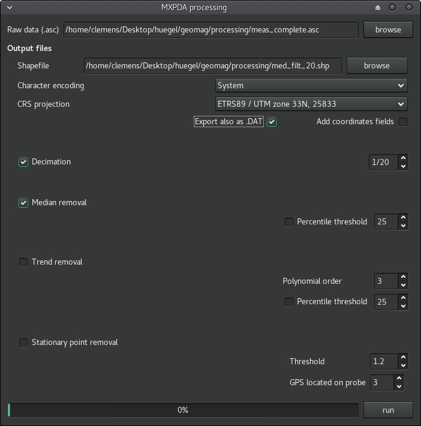

# barrow dataset

This dataset contains data from a fictive 2017 survey project on Atlantis that targeted one specific field in the northern coastal plain of the island. Actually it's decontextualized real world data from the DFG funded project [*Late Neolithic/Early Bronze Age developments in the south-west Baltic area (2500-1500 BC): Why did the Bruszczewo-Leki Male type of power structures appear?*](http://gepris.dfg.de/gepris/projekt/277223019) that can be shared here thanks to Professor Dr. Johannes Müller and Professor Dr. Janusz Czebreszuk. Thanks also go to Annalena Bock, Hendrik Raese, Marcin Ławniczak and many other students involved in the fieldwork.

The following files are available:

- Orthophoto (GeoTIFF)
- Digital Elevation Model (GeoTIFF)
- Magnetic survey data (decimated probe-wise point data CSV + GeoTIFF)

The georeferenced orthophoto and the digital elevation model from the site were created by photogrammetry of quadrocopter photos with [PhotoScan](http://www.agisoft.com/). The magnetic survey was undertaken with a 10 channel magnetometer system by [Sensys](http://www.sensysmagnetometer.com) and a mounted DGPS unit by Leica.

The following, additional steps beyond the normal data transformation were applied to prepare the survey data for the AtlantGIS repository. Most spatial data operations where performed with [gdal](http://www.gdal.org) (either with [command line utilities](http://www.gdal.org/gdal_utilities.html) or with [R packages](https://CRAN.R-project.org/package=rgdal) that use gdal internally).

## Orthophoto

- Change the coordinate reference system of the orthophoto to [EPSG:32628](http://spatialreference.org/ref/epsg/wgs-84-utm-zone-28n/), which is already in use for the other AtlantGIS data.

```
gdalwarp -t_srs 'EPSG:32628' orto1.tif orto2.tif
```

- Manipulate the position information to *move* the GeoTIFF to the fictive island Atlantis with the [GeoTiffExaminer](http://freegeographytools.com/2007/handling-tiff-worldfiles-with-geotiffexaminer).

- Compress the image. For the orthophoto it's possible to use aggressive JPEG compression: Only the visual impression matters, not the actually measured colour values.

```
gdal_translate \
  -co COMPRESS=JPEG \
  -co TILED=YES \
  -co JPEG_QUALITY=10 \
  orto2.tif orto3.tif
```

## Digital Elevation Model (DEM)

The first steps for the DEM are similar to the ones taken for the orthophoto:

- Change the coordinate reference system.

```
gdalwarp -t_srs 'EPSG:32628' dem.tif dem2.tif
```

- Manipulate the position information with the GeoTiffExaminer.

- Use raster calculation to adjust the general DEM height level to the fictive situation in the northern coastal plain of Atlantis.

```
gdal_calc.py -A dem2.tif --outfile=dem3.tif --calc="A+74+27"
```

- Compress the image. In this case JPEG can't be used. Instead a [lossless compression](https://gis.stackexchange.com/a/14196/60092) was applied.

```
gdal_translate \
  -co COMPRESS=lzw \
  -co TILED=YES \
  -co PREDICTOR=2 \
  dem3.tif dem4.tif
```

## Magnetic survey data

Sensys provides the proprietary software [DLMGPS](http://www.sensysmagnetometer.com/en/dlmgps.html) to combine spatial information from the mounted DGPS unit with the flux measurements from the magnetic probes. It offers an ASCII export that contains information for each individual measurement per probe:

x|y|magnetic flux in nT|measurement event|probe
:-----:|:-----:|:-----:|:-----:|:-----:
336.........|5..........|-0.3|2017....-......\_GZ.prm|1
336.........|5..........|0.6|2017....-......\_GZ.prm|2
336.........|5..........|-4.0|2017....-......\_GZ.prm|3
336.........|5..........|-2.1|2017....-......\_GZ.prm|4
336.........|5..........|0.0|2017....-......\_GZ.prm|5
336.........|5..........|-2.1|2017....-......\_GZ.prm|6

The QGIS Plugin [AGT (Archaeological Geophysics Toolbox)](https://github.com/narimanInrap/AGT) is an Open Source alternative to Sensys [Magneto](http://www.sensysmagnetometer.com/en/magneto.html) for basic magnetic data cleaning. It can deal with the ASCII output of DLMGPS. For this dataset only a minimal setup was used: Decimation of measurement count to a fraction of the initial values to minimise file size for the AtlantGIS repository and probe wise median normalisation.



AGT also has an ASCII output option. Further data cleaning and adjustments were done in R based on this tabulated data.

- Load AGT output file.

```
library(magrittr)

qgm <- readr::read_csv(
  "~/Desktop/huegel/geomag/processing/med_filt_20.dat",
  col_names = c("x", "y", "magnetic_flux_in_nT", "meas_event", "probe")
  ) %>%
  dplyr::select(
    -meas_event
  )
```

- Change the coordinate reference system and manipulate the position information. *XXX* and *YYY* are the distances to move the points to their new, artificial position on Atlantis.

```
qgm_sdf <- qgm
sp::coordinates(qgm_sdf) <- c("x", "y")
sp::proj4string(qgm_sdf) <- sp::CRS("+proj=utm +zone=33 +ellps=GRS80 +towgs84=0,0,0,0,0,0,0 +units=m +no_defs")
qgm_sdf <- sp::spTransform(qgm_sdf, sp::CRS("+proj=utm +zone=28 +datum=WGS84 +units=m +no_defs"))
qgm_trans <- as.data.frame(qgm_sdf)

qgm_cor <- qgm_trans %>%
  dplyr::mutate(
    x = x - XXX,
    y = y - YYY
  )
```

- Export text raw data before raster interpolation. The file is provided in AtlantGIS as **barrow_magnetic_raw_data.csv**.

```
write.csv(qgm_cor, "/home/clemens/Desktop/huegel/geomag/processing/barrow_magnetic_raw_data.csv")
```

- Raster interpolation. Creation of a coarse, artificial raster, rasterization of measurement data and filling holes with a moving window method. This is just one of many possible ways to interpolate a raster from the magnetic survey data.

```
e <- raster::extent(qgm_cor[,c("x", "y")])
r <- raster::raster(e, ncol = 500, nrow = 500)

mag_rast <- raster::rasterize(
  qgm_cor[,c("x", "y")], 
  r, 
  qgm_cor[,"magnetic_flux_in_nT"], 
  fun = mean
)

raster::projection(mag_rast) <- "+proj=utm +zone=28 +datum=WGS84 +units=m +no_defs"

#rasterVis::levelplot(mag_rast, at = -10:10)

fill.na <- function(x, i = 13) {
  if(is.na(x)[i]) {
    return(mean(x, na.rm=TRUE))
  } else {
    return(x[i])
  }
}  

mag_rast2 <- focal(
	mag_rast, 
    w = matrix(1,5,5), 
    fun = fill.na, 
    pad = TRUE, 
    na.rm = FALSE 
)

#rasterVis::levelplot(mag_rast2, at = -10:10)

writeRaster(mag_rast2, "~/Desktop/huegel/geomag/processing/barrow_magnetic.tif", overwrite = TRUE)
```